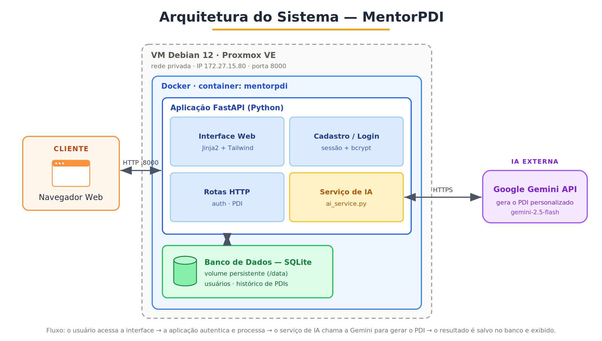

# MentorPDI — Documentação do Projeto

> Aplicação web que utiliza Inteligência Artificial como mentor de carreira em TI,
> gerando Planos de Desenvolvimento Individual (PDI) personalizados.

---

## 1. Descrição do problema

Profissionais de tecnologia frequentemente sabem que precisam evoluir, mas não sabem
**por onde começar**. As perguntas são sempre as mesmas: quais competências desenvolver,
quais certificações fazem sentido para o objetivo de carreira, em que ordem estudar e
como encaixar tudo isso na rotina. Mentoria de carreira individual é cara e pouco
acessível, e conteúdos genéricos da internet não consideram o ponto de partida de cada
pessoa.

## 2. Objetivo da solução

Oferecer um **mentor de carreira virtual** que, a partir do perfil informado pelo
usuário (cargo atual, experiência, objetivo, tecnologias que domina e tempo disponível),
gera automaticamente um **Plano de Desenvolvimento Individual (PDI)** estruturado e
acionável, contendo:

- diagnóstico do momento de carreira;
- pontos fortes e lacunas de competência;
- trilha de aprendizado em etapas, com recursos e duração;
- certificações recomendadas e priorizadas;
- cronograma sugerido;
- próximos passos imediatos.

Cada plano fica salvo, formando um **histórico** que o usuário pode revisitar e comparar
ao longo do tempo.

## 3. Tecnologias utilizadas

| Camada         | Tecnologia                                                  |
| -------------- | ----------------------------------------------------------- |
| Linguagem      | Python 3.11+                                                |
| Framework web  | FastAPI                                                     |
| Servidor ASGI  | Uvicorn                                                     |
| ORM / Modelos  | SQLModel (SQLAlchemy + Pydantic)                            |
| Banco de dados | SQLite (troca para PostgreSQL via variável de ambiente)     |
| Templates      | Jinja2                                                      |
| Estilo         | Tailwind CSS (via CDN) + CSS próprio                        |
| Sessão/Auth    | Starlette SessionMiddleware + bcrypt                        |
| IA             | API do Google Gemini — desacoplada, troca fácil de provider |
| Configuração   | pydantic-settings (.env)                                    |
| Implantação    | Docker + Docker Compose (em VM Debian sobre Proxmox VE)     |

## 4. Funcionamento da IA

Toda a integração está isolada no módulo `app/ai_service.py`. O fluxo é:

1. O usuário preenche o formulário de perfil.
2. A função `generate_pdi(dados)` monta dois prompts:
   - um **system prompt** que define o papel ("mentor de carreira sênior em TI") e
     obriga a resposta a sair **em JSON estruturado** num formato fixo;
   - um **user prompt** com os dados do perfil.
3. A requisição é enviada à API do provider configurado (Gemini, por padrão).
4. A resposta (JSON) é parseada de forma tolerante (`_parse_json`), tratando casos em
   que o modelo devolve o JSON dentro de blocos de markdown.
5. O resultado vira um dicionário Python, é salvo no banco como JSON e renderizado na tela.

**Por que pedir JSON estruturado?** Porque garante que a interface sempre receba os
mesmos campos (diagnóstico, trilha, certificações, etc.), permitindo renderizar uma UI
rica e consistente em vez de um texto solto.

**Troca de provider:** o módulo usa um dicionário de dispatch (`_PROVIDERS`). Para usar
outro provedor (como OpenAI ou Claude), basta implementar uma função `_call_<provider>`
e registrá-la. A escolha é feita pela variável `AI_PROVIDER` no `.env`.

## 5. Arquitetura do sistema

A figura abaixo apresenta a arquitetura do sistema em produção, do cliente até a API de
IA externa.



A aplicação segue uma arquitetura web em camadas, empacotada em contêiner e implantada em
uma máquina virtual:

- **Cliente:** o usuário acessa a aplicação pelo navegador, que se comunica com o servidor
  via HTTP (porta 8000).
- **Infraestrutura:** a aplicação roda dentro de um contêiner Docker (`mentorpdi`)
  hospedado em uma VM Debian 12 sobre o Proxmox VE, acessível pela rede privada.
- **Aplicação (FastAPI):** concentra a lógica do sistema, dividida por responsabilidade:
  - *Interface Web* — páginas renderizadas com Jinja2 + Tailwind;
  - *Cadastro / Login* — identificação do usuário, com sessão e senha protegida por bcrypt;
  - *Rotas HTTP* — endpoints de autenticação e de PDI;
  - *Serviço de IA* (`ai_service.py`) — responsável por montar o prompt e chamar a IA.
- **Persistência:** os dados (usuários e histórico de PDIs) são gravados em um banco
  SQLite que reside em um volume Docker persistente (`/data`), sobrevivendo a reinícios e
  reconstruções do contêiner.
- **IA externa:** o serviço de IA chama a API do Google Gemini (modelo `gemini-2.5-flash`)
  via HTTPS para gerar o conteúdo do PDI.

**Fluxo de uma requisição:** o usuário acessa a interface no navegador → a aplicação
FastAPI autentica a sessão e trata a rota → ao gerar um PDI, o serviço de IA envia o
perfil à API do Gemini e recebe o plano em JSON → o resultado é salvo no banco (volume
persistente) e exibido na tela. As consultas ao histórico leem diretamente do banco.

Organização das pastas:

```
PDI_application/
├── app/
│   ├── main.py            # aplicação FastAPI e rota inicial
│   ├── config.py          # configuração via .env
│   ├── database.py        # engine e sessão do banco
│   ├── models.py          # tabelas User e PDI
│   ├── auth.py            # hash de senha e sessão
│   ├── ai_service.py      # TODA a integração com IA
│   ├── templating.py      # instância compartilhada do Jinja2
│   ├── routers/           # rotas separadas por responsabilidade
│   ├── templates/         # páginas HTML
│   └── static/            # CSS
├── docs/                  # documentação e diagramas
├── Dockerfile             # imagem da aplicação
├── docker-compose.yml     # orquestração + volume persistente
├── requirements.txt
├── .env.example
└── README.md
```

**Modelo de dados:**

- `User` — id, username, email, password_hash, created_at.
- `PDI` — id, user_id (FK), título, snapshot do perfil informado (cargo, nível, área,
  objetivo, tecnologias, horas/semana) e `conteudo_json` com o plano gerado pela IA.

Guardar o snapshot do perfil **junto** com o resultado garante que o histórico seja fiel:
cada PDI registra exatamente o que foi pedido e o que a IA respondeu.

## 6. Prints da aplicação

> Substitua pelos prints reais tirados na sua máquina (sugestão de telas a capturar):

- Tela inicial (landing).
- Tela de cadastro / login.
- Formulário de geração de PDI.
- PDI gerado (diagnóstico, trilha, certificações, cronograma).
- Painel com o histórico de PDIs.

## 7. Principais desafios encontrados

- **Resposta estruturada da IA:** garantir que o modelo devolvesse sempre JSON válido.
  Resolvido com um system prompt rígido + um parser tolerante a blocos de markdown.
- **Compatibilidade de bibliotecas:** o `passlib` apresentou incompatibilidade com versões
  recentes do `bcrypt`. A solução foi usar a biblioteca `bcrypt` diretamente para o hash
  de senhas, removendo a dependência problemática.
- **Persistência do resultado da IA:** como o PDI tem estrutura variável (listas dentro de
  listas), optou-se por serializar o resultado em JSON num único campo, simplificando o
  modelo sem perder informação.
- **Desacoplamento da IA:** isolar a integração num único módulo para que trocar de
  provider (Gemini, Claude) não exija mexer no restante do sistema.
- **Implantação com persistência:** ao subir a aplicação em contêiner, foi necessário
  apontar o banco para um volume Docker (`/data`) para que os dados não se perdessem a
  cada reconstrução da imagem.

## 8. Conclusão

O projeto entregou uma aplicação funcional que cumpre todos os requisitos propostos:
integração real com IA, interface utilizável, identificação de usuário, funcionalidade
inteligente principal (geração do PDI), persistência em banco e histórico de recomendações.
Mais do que isso, mostrou na prática como conectar uma API de IA a uma aplicação web
tradicional, com atenção à experiência do usuário e a uma arquitetura organizada e
manutenível. A maior aprendizagem foi perceber que o valor da IA na aplicação depende
diretamente da qualidade do prompt e da estruturação da resposta — e que tratar a IA como
um "serviço" desacoplado torna o sistema mais flexível e fácil de evoluir.
